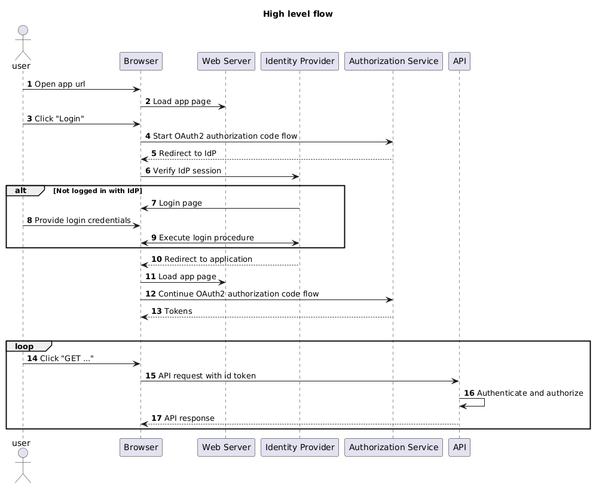

<!-- omit from toc -->
# Api Consumer Demo

## Introduction

This sample application demonstrates how Contact Pro APIs can be used from a browser with SSO based strong authentication. The demo application should not be used as such for productive usage, it is merely a technology demo and material for learning.

Tasks demonstrated by this demo:

1. How to acquire a JWT token securely from Contact Pro authorization service
2. How to call Contact Pro APIs with the token

## Table of contents

- [Introduction](#introduction)
- [Table of contents](#table-of-contents)
- [Skills required](#skills-required)
- [How the demo application works](#how-the-demo-application-works)
	- [HTTP request flow](#http-request-flow)
	- [Application architecture](#application-architecture)
- [Preparing Contact Pro tenant APIs for SSO](#preparing-contact-pro-tenant-apis-for-sso)
- [How to run demo app locally](#how-to-run-demo-app-locally)
	- [Prerequisites](#prerequisites)
	- [Prepare](#prepare)
	- [Run](#run)
- [How to run demo app on a web server](#how-to-run-demo-app-on-a-web-server)
	- [Plan and prepare](#plan-and-prepare)
	- [Build](#build)
	- [Deploy](#deploy)

## Skills required

To understand how the code accomplishes the tasks, some skills on single-page browser application technologies are required.

This application uses the [Svelte](https://svelte.dev/) UI framework. The same principles can be applied to other UI frameworks. At the moment the application is still using Svelte version 4, and not the fairly new version 5.

This application uses [Vite](https://vite.dev/) as a build tool.

This application uses [node](https://nodejs.org/en) as an environment to run the build tool.

## How the demo application works

Application's complexity is around two topics:

- A secure method to obtain authorized access to Contact Pro APIs
- A method to maintain state across page reloads

The application uses [OAuth 2 Authorization Code Grant](https://www.rfc-editor.org/rfc/rfc6749#section-4.1) with [RFC7636: Proof Key for Code Exchange by OAuth Public Clients](https://datatracker.ietf.org/doc/html/rfc7636) protocol to securely retrieve authorization grant, and to exchange it to an id token. The id token is conveyed with each request to Contact Pro API, which can then authenticate and authorize each request separately. Contact Pro API side does not need to persist any session for the requester, the session is in the browser instead.

The application uses browser's [session storage](https://developer.mozilla.org/en-US/docs/Web/API/Window/sessionStorage) to maintain state across page reloads.

### HTTP request flow

The basic flow of interactions between related network components is illustrated below:

### Application architecture

The demo application is built with these main components:

| File                                                                 | Purpose                                                                                                |
|----------------------------------------------------------------------|--------------------------------------------------------------------------------------------------------|
| [src/index.html](./src/index.html)                                       | Main page of the app, loads `main.js` to start app                                                     |
| [src/main.js](./src/main.js)                                             | Bootstrap code for app, loads main Svelte component `App.svelte`                                       |
| [src/App.svelte](./src/App.svelte)                                       | Top level UI component of the app                                                                      |
| [src/configuration.js](./src/configuration.js)                           | Configuration for app, actual values come from file `env/.env`                                         |
| [src/components/ApiTest.svelte](./src/components/ApiTest.svelte)         | UI component with a set of buttons to test API requests                                                |
| [src/components/LoginButton.svelte](./src/components/LoginButton.svelte) | Login button component with methods for loggin in and out, and a hook to handle page reloads           |
| [src/lib/auth-session.js](./src/lib/auth-session.js)                     | Class `AuthSession` to store API session in browser's session storage                                  |
| [src/lib/session-manager.js](./src/lib/session-manager.js)               | Class `SessionManager` with logic to manage API session, including implementation of PKCE              |
| [src/lib/session.js](./src/lib/session.js)                               | Class `Session` (and instance session) that extends `SessionManager` with info about CPro API endpoint |

Dependency graph:

	index.html
		main.js
			App.svelte
				ApiTest.svelte
				LoginButton.svelte
				configuration.js
				session.js
					session-manager.js
						auth-session.js

## Preparing Contact Pro tenant APIs for SSO

Assuming that SSO is already enabled for your Contact Pro tenant.

In order to use this application with a Contact Pro tenant, some preparations has to be done on Contact Pro side, which require a service request to Contact Pro technical operations team.

**For the service request you will need:**

1. Tenant id
2. Allowed callback URL
3. Allowed sign-out URL
4. Allowed origin (CORS)

> Items 2-4 depend on how your application is constructed, and where it is hosted in.

**You will get:**

1. Authentication URL
2. Client id
3. API URL

For testing purposes you can run this demo app locally with [Vite](https://vite.dev/). For detailed instructions, refer to chapter - [How to run demo app locally](#how-to-run-demo-app-locally).

## How to run demo app locally

### Prerequisites

You'll need node version 20, or later.

### Prepare

The default settings in [vite.config.js](vite.config.js) enable to run this demo application locally at http://localhost:56001.

To enable running this demo application with your Contact Pro tenant, create a service request with:

1. Your tenant id
2. Allowed callback URL: http://localhost:56001
3. Allowed sign-out URL: http://localhost:56001
4. Allowed origin: http://localhost:56001

> Note that wen running your real application, you'll need to make a new service request with proper URLs.

Once you've received response, enter the values (authentication URL, client id, API URL) into the [env/.env](env/.env) file.

### Run

1. Execute `npm i`
2. Execute `npm run dev`
3. Open http://localhost:56001 with browser
4. Click the `Login` button to login with your SSO
5. When autheticated, try out the `GET ...` buttons

## How to run demo app on a web server

This application can be hosted by any web server that is capable of serving static files.

### Plan and prepare

Decide which base path shall the application have on your web server. If it is in root, the default settings are ok. If that's not the case, you'll have to add [base](https://vite.dev/config/shared-options.html#base) setting to [vite.config.js](./vite.config.js).

Once you know the base URL of your web server, and the base path of the application, you'll have to create a service request to Contact Pro operations to prepare Contact Pro side. Refer to chapter [Preparing Contact Pro tenant APIs for SSO](#preparing-contact-pro-tenant-apis-for-sso).

### Build

To build a minified version of the app, execut command `npm run build`. The result is a set of files and directories under `dist`.

### Deploy

Simply copy contents of `/dist` to your web server.
