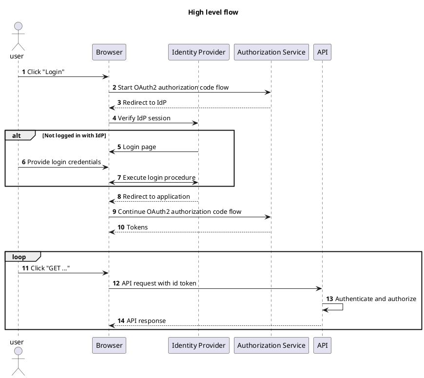

```plantuml
@startuml high-level-flow
title High level flow

autonumber
actor user
participant "Browser" as browser
participant "Identity Provider" as idp
participant "Authorization Service" as authsrv
participant "API" as api

user -> browser : Click "Login"

browser -> authsrv : Start OAuth2 authorization code flow
authsrv --> browser : Redirect to IdP
browser -> idp : Verify IdP session

alt Not logged in with IdP
	idp -> browser : Login page
	user -> browser : Provide login credentials
	idp <-> browser : Execute login procedure
end

idp --> browser : Redirect to application
browser -> authsrv : Continue OAuth2 authorization code flow
authsrv --> browser : Tokens
|||

loop
	user -> browser : Click "GET ..."
	browser -> api : API request with id token
	api -> api : Authenticate and authorize
	api --> browser : API response
end

@enduml
```
